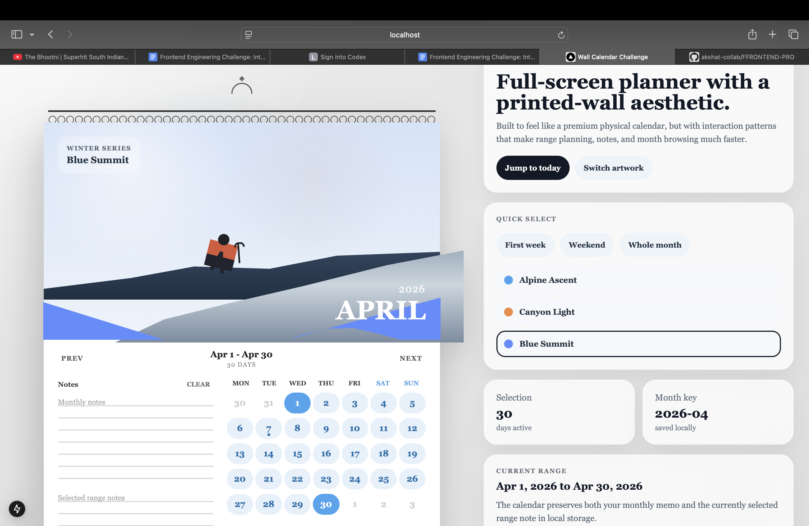
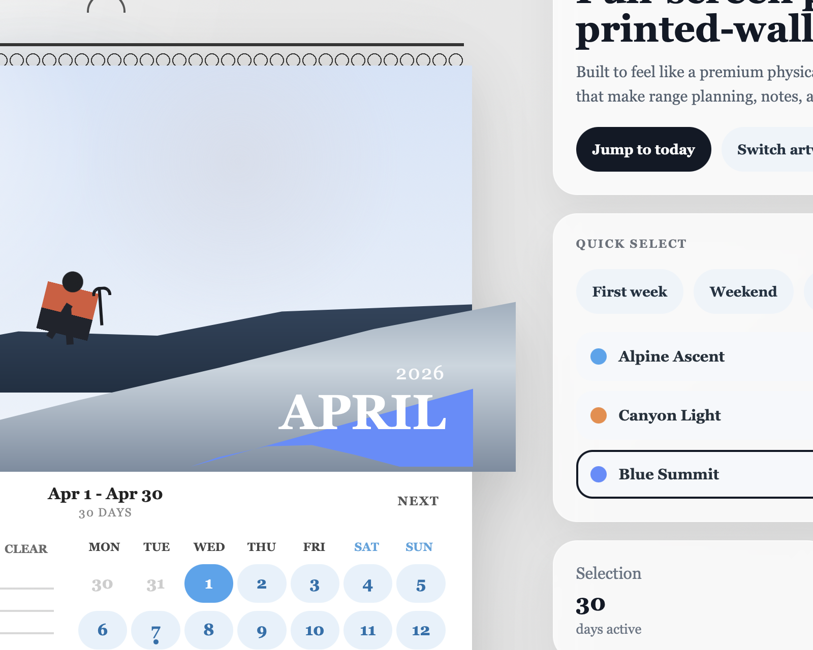

# Wall Calendar Challenge

An interactive Next.js wall calendar inspired by a printed hanging calendar, reworked into a full-screen planning experience with range selection, notes, presets, and responsive behavior.

## Preview

### Full Experience



### Calendar Detail



## What I Built

- A large-format wall calendar layout with spiral binding, poster artwork, and a printed-paper lower section
- Date range selection with clear start, end, in-range, holiday, and today states
- Monthly notes and selected-range notes with client-side persistence via `localStorage`
- Scene switching for the calendar artwork
- Quick-select presets for `First week`, `Weekend`, and `Whole month`
- A side utility panel with active range summary, holiday markers, and shortcut actions
- Responsive behavior that expands nicely on laptop and desktop screens and collapses cleanly on mobile

## Product / UI Decisions

- The top half is treated like a physical calendar poster so the component feels visual first, not just like a utility grid.
- The bottom half intentionally mirrors the reference layout with notes on one side and dates on the other.
- Extra controls were moved into a separate side panel so the calendar sheet itself still feels clean and poster-like.
- The interaction layer stays frontend-only, which keeps the submission aligned with the challenge scope.

## Tech Stack

- Next.js 15
- React 19
- CSS Modules
- `localStorage` for persistence

## Run Locally

```bash
npm install
npm run dev
```

Open [http://localhost:3000](http://localhost:3000).

For a production build:

```bash
npm run build
```

## Project Structure

- `app/page.js` - entry page
- `components/WallCalendar.js` - main interactive calendar experience
- `components/WallCalendar.module.css` - full styling and responsive behavior
- `pages/403.js` - compatibility fallback page for the current Next.js dev runtime
- `public/readme/` - README preview images

## Feature Notes

- Notes are saved per month.
- Selected range notes are saved against the active selected range.
- Artwork preference is also persisted locally.
- Holiday markers are lightweight mock data to keep the challenge frontend-focused.

# FFRONTEND-PRO
